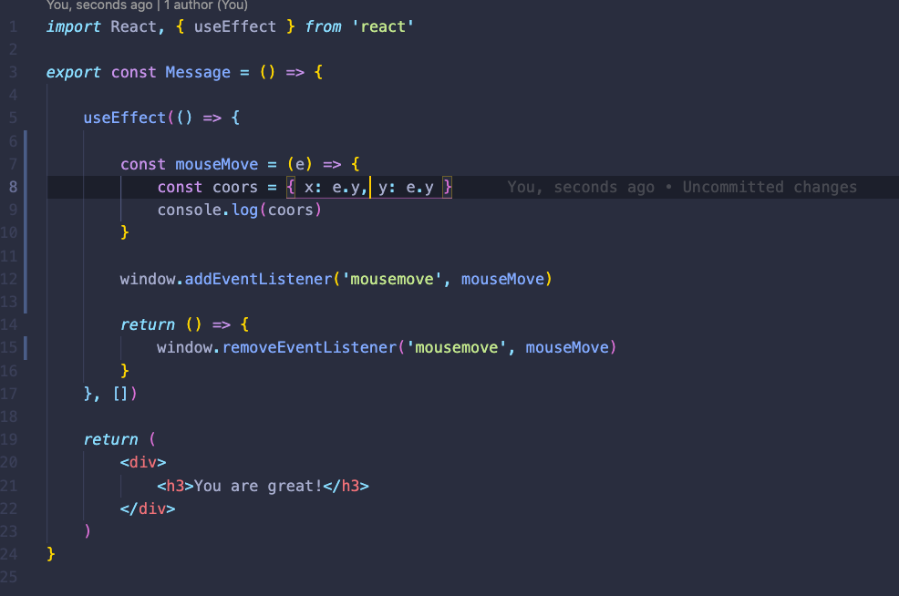
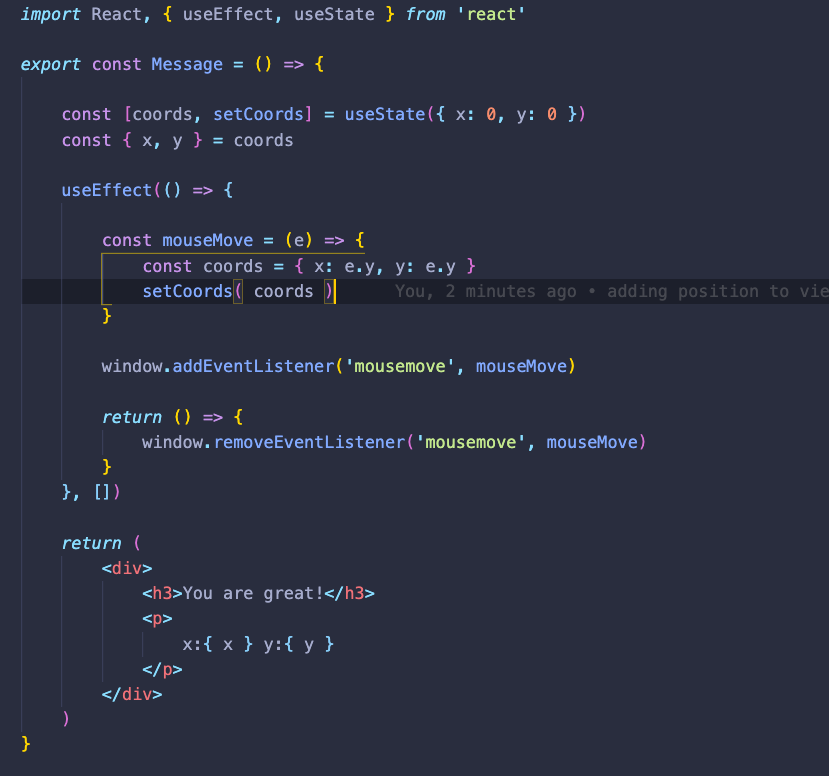
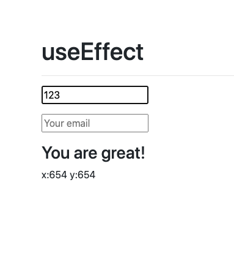

### Hooks
+ Hooks used to build a simple CounterApp

+ Example with useEffect

+ Interesting things that you can do with useEffect. Adding conditions to views:

+ The code should look something like this:

+ Here's the condition:

+ A correct way to clean an event and prevent lots of memory consumption

+ Another example but using useState instead of:

